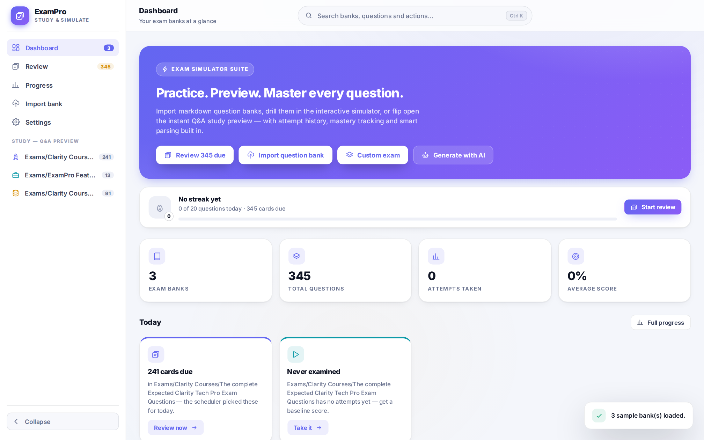
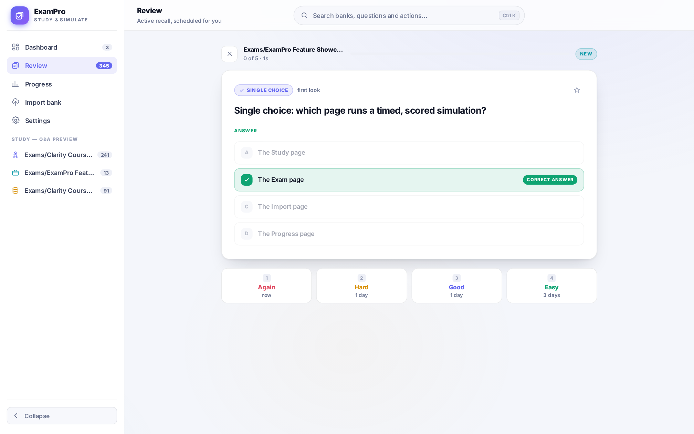
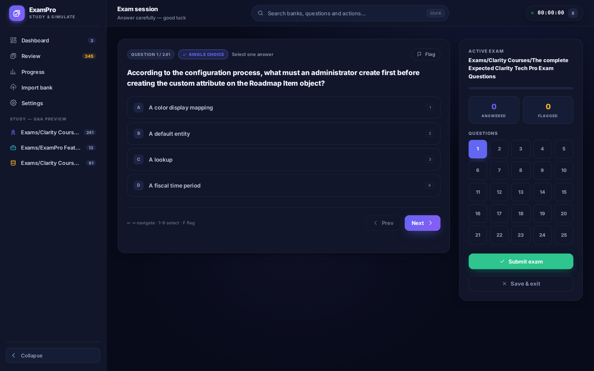
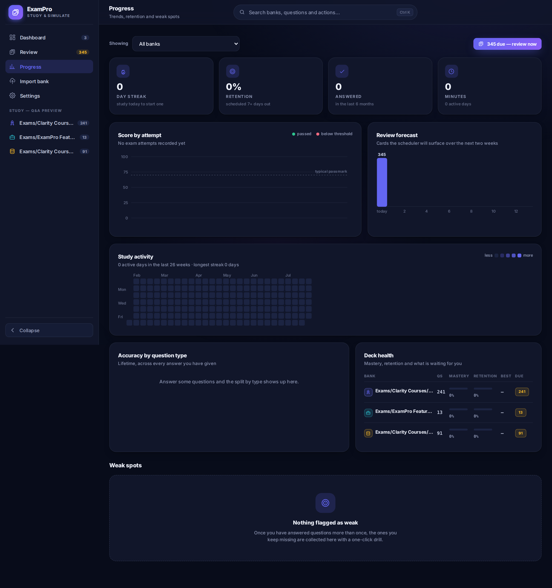
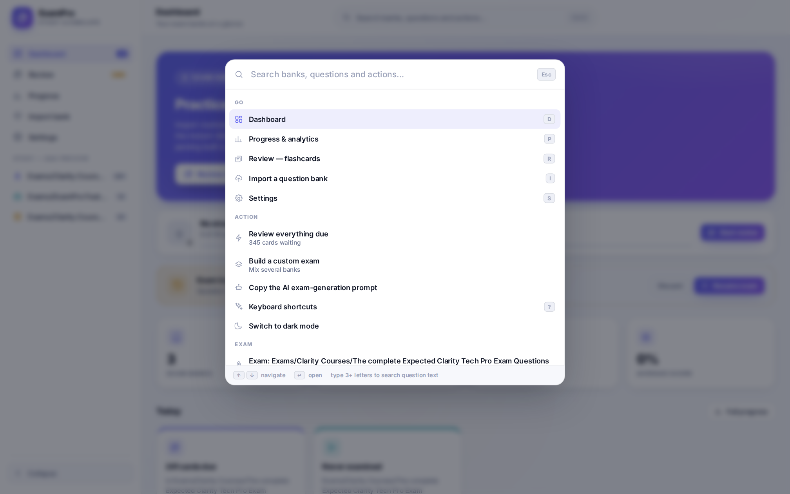
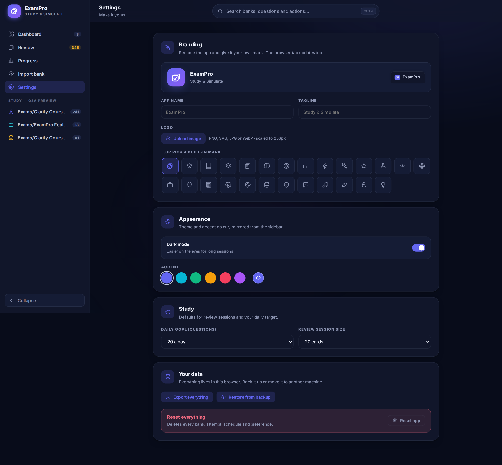

<div align="center">


# ExamPro

**Import any question bank. Study it with spaced repetition. Pass the real thing.**

### [**Try the live demo →**](https://amerzuher.github.io/Exam-Simulator/)

[](LICENSE)
[](https://amerzuher.github.io/Exam-Simulator/)


<picture>
  <source media="(prefers-color-scheme: dark)" srcset="docs/images/dashboard-dark.png">
  <source media="(prefers-color-scheme: light)" srcset="docs/images/dashboard-light.png">
  
</picture>

</div>

---

## Contents

- [What this is](#what-this-is)
- [Features](#features)
- [Screenshots](#screenshots)
- [Quick start](#quick-start)
- [Bring your own question bank](#bring-your-own-question-bank)
  - [Generate one with AI](#dont-have-a-question-bank-generate-one-with-ai)
- [Keyboard shortcuts](#keyboard-shortcuts)
- [How it works](#how-it-works)
- [Project structure](#project-structure)
- [Your data](#your-data)
- [Deploying your own copy](#deploying-your-own-copy)
- [FAQ](#faq)
- [Credits](#credits)
- [License](#license)

---

## What this is

ExamPro turns a plain markdown or JSON question bank into three different ways to
learn it:

1. **Study** — every question and its answer, side by side, searchable and
   filterable, with a "quiz me" mode that hides answers until you ask.
2. **Review** — one card at a time, active recall, scheduled by an SM-2 spaced
   repetition engine so the cards you're shaky on come back sooner and the ones
   you know get pushed weeks out.
3. **Exam** — a timed, scored simulation with a countdown, question pools
   ("weak spots", "due for review", "never seen"), and a results page that
   tells you not just your score but *where the clock went*.

It runs as a single static site — open `index.html` and it works. No server, no
build step, no account, no tracking. Everything is stored in your browser.

## Features

<table>
<tr><td width="50%" valign="top">

**Study system**

- SM-2 spaced repetition (ease factor, intervals, lapses)
- 4-grade active recall — Again / Hard / Good / Easy
- Mastery stars, print-to-PDF Q&A sheets
- Search, filter by type / mastered / due

**Exam engine**

- Smart pools: everything, weak spots, due, never-seen, mastered-only
- Optional countdown timer with auto-submit
- Shuffle questions and/or options
- Flag-for-review, resume an in-progress exam later
- Custom exams mixing several banks

</td><td width="50%" valign="top">

**Progress & analytics**

- Score trend, study-activity heatmap, review forecast
- Accuracy by question type
- Weak-spot list with one-click drill sessions
- Pace analysis on every result — slow *and* wrong vs. fast *and* wrong

**Everything else**

- Command palette (`Ctrl/⌘ K`) — fuzzy search banks, actions, and question text
- Per-bank icon + colour, your own app name/logo/accent, installable PWA
- One-click JSON backup & restore — your data, portable

</td></tr>
</table>

## Screenshots

<table>
<tr>
<td width="50%"></td>
<td width="50%"></td>
</tr>
<tr>
<td width="50%"></td>
<td width="50%"></td>
</tr>
</table>

<details>
<summary>Settings — rename the app, upload a logo, pick your own accent colour</summary>
<br>

</details>

## Quick start

No install, no dependencies, no build step.

```bash
git clone https://github.com/AmerZuher/Exam-Simulator.git
cd Exam-Simulator
```

Then pick one:

| Method                | How                                                                                                                                                                                                                                                                                                                                 |
| --------------------- | ----------------------------------------------------------------------------------------------------------------------------------------------------------------------------------------------------------------------------------------------------------------------------------------------------------------------------------- |
| **Try it online**     | Skip setup entirely — the live build is hosted at **[amerzuher.github.io/Exam-Simulator](https://amerzuher.github.io/Exam-Simulator/)**.                                                                                                                                                                                          |
| **Just open it**      | Double-click `index.html`. A tiny guided sample loads automatically.                                                                                                                                                                                                                                                                |
| **Any static server** | `python3 -m http.server 8080` (or any static file server) from the project root, then visit `http://localhost:8080`. Serving over HTTP lets the app auto-load the full bundled sample set, including `Exams/ExamPro Feature Showcase.md` — a bank built specifically to demonstrate every supported question type and media format. |

There is nothing to `npm install`. The only thing resembling a dependency is the
Inter font, loaded from Google Fonts over a `<link>` tag — everything else is
plain HTML, CSS and JavaScript.

## Bring your own question bank

Import → paste markdown or JSON → the importer validates it live and tells you
exactly what didn't parse and why.

**Markdown**, the fast way to write a bank by hand:

```md
### 1. Which learning technique uses increasing intervals between reviews to boost retention?
- [ ] Massed practice
- [ ] Spaced repetition
- [ ] Cramming
- [ ] Random review

### 2. Select all that apply: which are primary colors?
- [ ] Red
- [ ] Green
- [ ] Blue
- [ ] Purple

### 3. Matching: pair each term with its definition.
- [ ] Alpha
- [ ] Beta
Definition A: first letter
Definition B: second letter

### Answer Key
| Question Number | Correct Answer |
| :-- | :-- |
| 1 | Spaced repetition |
| 2 | • Red <br>• Blue |
| 3 | Alpha, Beta |
```

Supported out of the box: single choice, multi-select, true/false, matching,
letter-keyed answers (`B`, `c)`), answer keys as a table *or* a list, images
(``), audio (`[audio: file.mp3]`) and video (`[video: file.mp4]`).
Numbering can restart across sections of the same document — everything gets
renumbered on import.

### Don't have a question bank? Generate one with AI

You don't have to write questions by hand. Both the Dashboard and the Import
page have a **"Generate with AI" / "Copy AI prompt"** button — click it and a
prompt is copied to your clipboard, pre-written to make any AI chat (ChatGPT,
Claude, Gemini, whatever you use) output questions in exactly the format
ExamPro's parser expects.

1. Click **Copy AI prompt**.
2. Paste it into your AI chat of choice, then paste in your own source
   material underneath — lecture notes, a textbook chapter, a study guide,
   documentation, anything you want to be quizzed on.
3. The AI generates a full question set — single choice, multi-select,
   true/false, matching — already formatted as valid ExamPro markdown, answer
   key included.
4. Copy its output straight into the **Paste content** box on the Import page
   and hit **Parse & save bank**.

No manual formatting, no guessing the syntax — the prompt tells the AI the
exact rules (heading format, option style, matching layout, answer key
table) so what comes back imports cleanly on the first try.

**JSON** works too — either a bare array of questions or the
`{ "name", "questions": [...] }` shape produced by *Export as JSON*. Paste
your own hand-written JSON and the importer fills in anything you omit.

For the complete, working reference — every question type, every answer-key
style, image/audio/video attachments, all annotated — see
[`Exams/ExamPro Feature Showcase.md`](<Exams/ExamPro Feature Showcase.md>)
(and its [JSON twin](<Exams/ExamPro Feature Showcase.json>)). Import it and
open Study to see exactly how each part was parsed.

## Keyboard shortcuts

| Key                         | Where    | Does                                              |
| --------------------------- | -------- | ------------------------------------------------- |
| `Ctrl/⌘ K`                  | anywhere | Open the command palette                          |
| `D` / `R` / `P` / `I` / `S` | anywhere | Dashboard / Review / Progress / Import / Settings |
| `?`                         | anywhere | Keyboard shortcut help                            |
| `/`                         | Study    | Focus the search box                              |
| `← →`                       | Exam     | Previous / next question                          |
| `1–9`                       | Exam     | Select an answer option                           |
| `F`                         | Exam     | Flag the current question                         |
| `Space`                     | Review   | Flip the card                                     |
| `1 2 3 4`                   | Review   | Grade: Again / Hard / Good / Easy                 |

## How it works

- **No framework.** Every view is a plain object with a `render(root)` function;
  a ~50-line hash router swaps them in and out of `#view`.
- **No backend.** All state — banks, attempt history, the SM-2 schedule,
  per-question stats, settings, branding — lives in `localStorage`.
- **No bundler.** `<script>` tags in a fixed load order in `index.html`. Open
  the file, it works, including straight off disk via `file://`.
- **Charts are hand-rolled inline SVG** (`app/js/charts.js`) with a real
  crosshair tooltip and a colourblind-validated palette — no charting library.
- **The importer is DOM-free** (`app/js/parser.js`) — pure string in, structured
  questions out — so it's testable in plain Node with no browser involved.
- **Installable.** `manifest.json` + `service-worker.js` make it a PWA; it
  caches itself for offline use once you've visited it over HTTP once.

## Project structure

```
index.html                  entry point — script load order lives here
manifest.json                PWA manifest (rewritten live from your branding)
service-worker.js            offline cache
app/
  css/app.css                 the entire design system — one file, CSS custom properties
  js/
    utils.js, store.js         small helpers · localStorage-backed state
    srs.js                     SM-2 scheduler, per-question stats, streaks
    parser.js                  markdown → question bank (DOM-free, unit-testable)
    ui.js                      toasts, modals, rings, sparklines, media, bank badges
    charts.js                  inline-SVG line / column / heatmap charts
    branding.js                app name, logo, live favicon + manifest
    palette.js                 Ctrl+K command palette
    icons.js                   SVG icon registry
    router.js, main.js         hash router · bootstrap
    views/                     dashboard, importer, study, review, exam, results,
                                progress, settings — one file per screen
Exams/                        your question banks live here (bring your own)
  ExamPro Feature Showcase.md  a working bank that demonstrates every format
docs/images/                  README screenshots
```

## Your data

Everything — banks, scores, review schedule, settings, your custom branding —
is stored in `localStorage`, scoped to whatever origin you're serving the app
from. Nothing is sent anywhere. There is no account, no sync, no analytics.

Settings → **Your data** gives you a one-click JSON export of the entire
app state, and a matching restore. That file is your backup and your
migration path to another browser or machine — there is no other kind of
"cloud sync" here by design.

## Deploying your own copy

It's a static site, so any static host works — GitHub Pages, Netlify, Vercel,
Cloudflare Pages, or just a folder on any web server:

**GitHub Pages**, straight from your existing branch, no extra branch needed:

1. Push to your repo's default branch (`master` or `main`)
2. Repo **Settings → Pages**
3. **Build and deployment → Source:** `Deploy from a branch`
4. **Branch:** your default branch, folder `/ (root)` → **Save**
5. GitHub builds and serves it at `https://<you>.github.io/<repo>/` within a
   minute or two — the banner at the top of the Pages settings page confirms
   the URL once it's live

Serving over HTTP (rather than `file://`) is what enables auto-loading the
bundled sample banks and the PWA service worker — both are optional, the app
works either way.

## FAQ

**Does this need an internet connection?**
No, after the first load (or never, if you use `file://`). The only network
calls are: loading the Inter font, fetching bundled sample banks on first run
when served over HTTP, and — if you use it — copying the AI-prompt text to
your clipboard, which involves no network at all.

**Can I use it on my phone?**
Yes — it's responsive, and installable as a PWA from a browser's "Add to Home
Screen" menu once it's served over HTTPS somewhere.

**What happens if I clear my browser data?**
Your banks and progress are gone unless you exported a backup first
(Settings → Export everything). This is the tradeoff of "nothing leaves your
browser" — back up before you clear site data.

**Can multiple people use the same instance?**
Not with shared state — there's no backend and no accounts. Each browser
profile has its own independent data. Export/import is how you'd move a bank
from one person to another.

## Credits

The idea for this project started as a collaboration between **Kimi K3** and
**DeepSeek V4 Pro**. The UI overhaul, feature buildout and testing in this
version were done with **Claude Opus 5** and **Claude Sonnet 5** (Anthropic),
via Claude Code.

## License

MIT — see [LICENSE](LICENSE). Do what you want with it; attribution is
appreciated but not required.

---

<div align="center">
<sub>Built for people who'd rather study the material than fight the tool.</sub>
</div>
